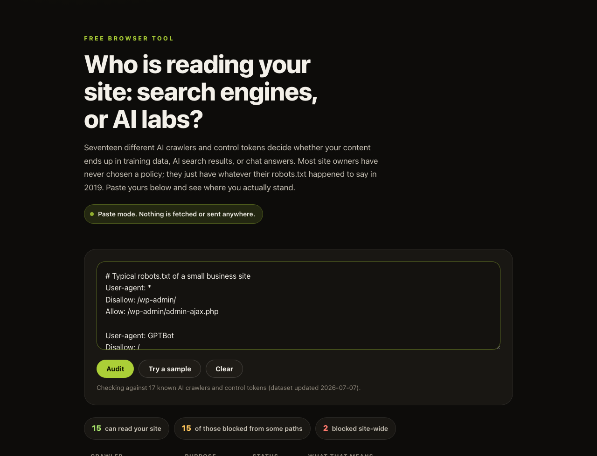

# AI Crawler Audit 🤖

See exactly which AI crawlers your robots.txt allows or blocks, understand what each one actually does, and generate a policy you chose on purpose. Works on pasted robots.txt in the browser, or against live sites with the bundled CLI.

<p>
  <a href="https://jaydenyoonzk.github.io/ai-crawler-audit/"></a>
  <a href="https://github.com/JaydenYoonZK/ai-crawler-audit/stargazers"></a>
  <a href="LICENSE"></a>
</p>

<a href="https://jaydenyoonzk.github.io/ai-crawler-audit/?demo">
  
</a>

**[Open the live tool](https://jaydenyoonzk.github.io/ai-crawler-audit/)** or **[see a sample audit](https://jaydenyoonzk.github.io/ai-crawler-audit/?demo)**. Paste mode sends nothing anywhere.

## Why this exists

Seventeen AI crawlers and control tokens currently decide whether your content ends up in model training data, AI search results, or live chat answers. They have different jobs and different consequences when blocked, yet most robots.txt files treat them as one blob, or do not mention them at all. Blocking `GPTBot` says nothing about `ChatGPT-User`. Blocking `Google-Extended` does not affect Google Search. These distinctions matter and are easy to get wrong.

This tool audits your actual file against a curated, documented dataset and explains each result in plain language.

## What it does

- **Audit**: paste a robots.txt, get a per-crawler verdict (allowed, partial, blocked, default) computed with a proper RFC 9309 matcher: rule groups, longest-match precedence, allow winning ties, `*` and `$` wildcards
- **Explain**: every crawler is labeled by what it is for (training, AI search, live user fetches, or a control token) with vendor documentation linked
- **Generate**: three ready-to-copy policies, including the one most small sites actually want: block training, keep AI search and user fetches
- **llms.txt**: a structural check for the emerging [llms.txt](https://llmstxt.org/) convention

## The CLI

The browser cannot fetch other sites' files, so live audits ship as a zero-dependency CLI:

```bash
npx github:JaydenYoonZK/ai-crawler-audit example.com
```

```
AI crawler audit for https://example.com

  GPTBot            BLOCKED   training   Blocked site-wide by a "GPTBot" group.
  OAI-SearchBot     ALLOWED   search     Allowed by the "*" group.
  ...
  llms.txt: not found (optional, see https://llmstxt.org/)
```

## The dataset

The heart of the project is [`docs/data/crawlers.json`](docs/data/crawlers.json): 17 crawlers and control tokens with vendor, purpose, documentation link, and honest notes (including which entries have no official docs and which have been reported ignoring robots.txt). It is versioned, dated, and reviewable in one screen.

New bots appear constantly. If you see one in your logs, a pull request with a log sample and a documentation link is the fastest way to get it added.

## Tests

```bash
npm test
```

14 tests cover group parsing, wildcard matching, precedence rules, case handling, policy generation, and a round-trip proving generated policies audit as fully blocked. The dataset itself has an integrity test.

## License

MIT. Built and maintained by [Jayden Yoon ZK](https://github.com/JaydenYoonZK). Sibling projects: [AI Paste Cleaner](https://github.com/JaydenYoonZK/ai-paste-cleaner) and [Phantom Deps](https://github.com/JaydenYoonZK/phantom-deps).
